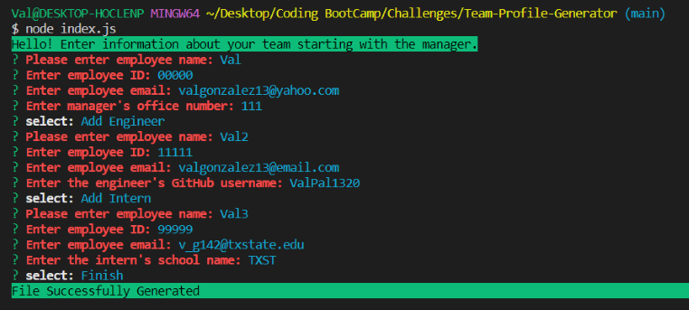

# Team Profile Generator

## Table of Contents
  * [Description](#description)
  * [Installation](#installation)
  * [Usage](#usage)
  * [Contribution](#contribute)
  * [Tests](#tests)
  * [Questions](#questions)

## Description
This command-line application will allow a user to enter information about employees on a software engineering team and generates and HTML site displaying summaries of each person on the team. It will start by prompting the user to enter manager information, then they have the choice to add an engineer or intern. The profiles of each team member include name, ID, email, and github username if they're an engineer or school if they're an intern.

When user is finished, they will select "Finish" and a file will be generated. Sample html file included in the dist folder.

You can view an instructional video [HERE](https://drive.google.com/file/d/1OjJ5KF2vCd87ZWePptaHF-ihjCsmp05e/view).

## Installation
 Before using this application, be aware you will need the following softwares installed already: 
  * VS Code 
  * GitBash 
  * Node.js

To install:
  - Click on the green "Code" button to clone to your folder 
  - `npm install inquirer`
  - If testing, run `npm i jest` to install Jest
  - Open application folder in your terminal and type `node index.js`

## Usage
After running `node index.js` to start application, answer questions and enter each team member's information. When done, select "Finish" and a new html file will be generated. 

Screenshot below for reference:
  

## Contribution
No other contributors at the moment. If you'd like to contribute, feel free to contact me.

## Tests
You may run `npm test` to run Jest for tests.

## Questions
Have any questions? Please feel free to reach out!  
GitHub: https://github.com/ValPal1320  
Email: valgonzalez13@yahoo.com